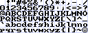

# 8x8 Pixel Bitmap Font

This font is meant for retro computers like the [JU+TE computer](https://github.com/boert/JU-TE-Computer) (east german 8-bit computer from the end of the 80s).

The is defined in a plain bitmap:

and can be converted to binary data with the Java application at [src/Main.java](src/Main.java).
Each "dark" color will be treated as `1` and each "light" color as `0`.
The light-blue lines (also converted to `0`) are just visual guides to mark pixels that should remain empty to prevent neighboring characters from touching.

The font is inspired by several retro fonts.

You can easily convert it to a TTF using the service at https://yal.cc/tools/pixel-font/.
